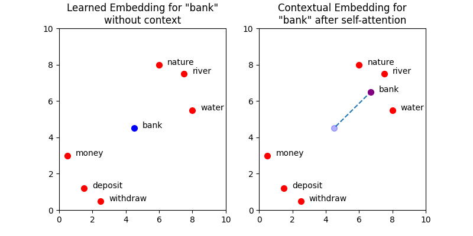

# Self-attention

A self-attention mechanism is a core component of transformer neural networks that allows a model to weigh the importance of different elements within an input sequence to understand relationships and context. It works by calculating query, key, and value vectors for each element, then determining attention scores based on the similarity between queries and keys. These scores are used to create a weighted sum of the value vectors, producing a contextual representation that helps the model focus on relevant information.

## Transformers

 The Transformer is a deep neural network architecture that is the foundation for almost all LLMs today. Derivative models are often called Transformer-based models or transformers for short, and so these terms will be used interchangeably here. Like all machine learning models, transformers work with numbers and linear algebra rather than processing human language directly. Because of this, they must convert textual inputs from users into numerical representations through several steps. Perhaps the most important of these steps is applying the self-attention mechanism. The process of representing text with vectors is called embedding (or encoding), hence the numerical representations of the input text are known as transformer embeddings.
 
Transformers overcome the limitations of static embeddings by producing their own context-aware transformer embeddings. In this approach, fixed word embeddings are augmented with contextual information (how the words are used). The self-attention blocks are responsible for contextual augmentations. By incorporating this additional information, transformers can produce much more powerful vector representations of words based on their usage in the input sequence. Extending the vector representations beyond static embeddings is what enables Transformer-based models to handle polysemous words and gain a deeper understanding of language compared to previous models.

## Visualising how self-attention contextualises embeddings

The plots below show a simplified set of learned embedding vectors in two dimensions. Words associated with nature and rivers are concentrated in the top right quadrant of the graph, while words associated with money are concentrated in the bottom left. The vector representing the word bank is positioned between the two clusters due to its polysemic nature. The objective of self-attention is to move the learned embedding vectors to regions of vector space that more accurately capture their meaning within the context of the input sequence. In the example input Write a poem about a man fishing on a river bank., the aim is to move the vector for bank in such a way that captures more of the meaning of nature and rivers, and less of the meaning of money and deposits.

More accurately, the goal of self-attention here is to update the vector for every word in the input, so that all embeddings better represent the context in which they were used. Self-attention is applied across all the words. In this case the effect neighbouring words have on bank is being visualised. But in reality every token is being influenced by its neighbouring words. The self-attention block in a transformer is responsible for contextualising the embeddings of every token in the input. 

Imagine for instance the sentence 

```'Write a poem about a man fishing on a river bank'``` 

The embedding (some vector of multiple elements) for the word bank will be influenced by its context, so that it's meaning gets closer to its direct context.



## How does it work

Below is a complete overview of the embedding process, first words are converted to token-ids, than token-ids are converted to embeddings (one multivariate vector per token-id), than positional information is added to the embedding (no further information for now) and finally context is added through self-attention.


## Tokenizing and embedding

A very simplistic way to tokenize the words in the sentence would be something like below.

```
sentence="Write a poem about a man fishing on a river bank"
input_ids = {s: i for i, s in enumerate(sorted(sentence.split()))}
input_tokens = torch.tensor([input_ids[s] for s in sentence.split()])
```

The sentence is being split into separate words, which are than sorted, enumerated and put in a dictionary, with its value (the number i retrieved when enumerating).
A dictionary can only contain unique keys so repeating words are being omitted.
The dictionary looks like below:

```
{'Write': 0, 'a': 3, 'about': 4, 'bank': 5, 'fishing': 6, 'man': 7, 'on': 8, 'poem': 9, 'river': 10}
```

And the tokenized sentence looks like below:

```
tensor([ 0,  3,  9,  4,  3,  7,  6,  8,  3, 10,  5])
```
At this moment every word is represented by an id, which is just an identifier. 

A way to create an embedding for this sentence would be to use an embedding layer as present in torch. In this case the size of the dictionary (the number of unique words) is used as the number of embeddings and an arbitrary number is chosen for the embedding dimension.

```
import torch
embed = torch.nn.Embedding(11, 16)
embedded_sentence = embed(input_tokens).detach()
```

The first two words of the embedded sentence look like below. So for every word 16 floating point values are generated.

```
tensor([[ 0.3374, -0.1778, -0.3035, -0.5880,  0.3486,  0.6603, -0.2196, -0.3792,
          0.7671, -1.1925,  0.6984, -1.4097,  0.1794,  1.8951,  0.4954,  0.2692],
        [ 0.8768,  1.6221, -1.4779,  1.1331, -1.2203,  1.3139,  1.0533,  0.1388,
          2.2473, -0.8036, -0.2808,  0.7697, -0.6596, -0.7979,  0.1838,  0.2293]])
```

## Mechanism

As stated, the goal of self-attention is to move the embedding for each token to a region of vector space that better represents the context of its use in the input sequence. What we didn’t discuss is how this is done. Here we will show a step-by-step example of how the self-attention mechanism modifies the embedding for bank, by adding context from the surrounding tokens.

The context of a token is given by the surrounding tokens in the sentence. Therefore, we can use the embeddings of all the tokens in the input sequence to update the embedding for any word, such as bank. Ideally, words that provide significant context (such as river) will heavily influence the embedding, while words that provide less context (such as a) will have minimal effect.

The degree of context one word contributes to another is measured by a similarity score. Tokens with similar learned embeddings are likely to provide more context than those with dissimilar embeddings. The similarity scores are calculated by taking the dot product of the current embedding for one token (its learned embedding plus positional information) with the current embeddings of every other token in the sequence. For clarity, the current embeddings have been termed self-attention inputs in this article and are denoted x.

### QKV 

This self-attention mechanism allows the model to focus on different parts of the input sequence and weigh their importance when making predictions. To fully understand how this works, we need to dive into the matrices that drive it: Q (Query), K (Key), and V (Value). 

It's not the math that is difficult, but what is difficult is understanding the "why" as much as the "how." Why do these matrices work? What do each of the matrices do? Why are there even three matrices? What is the intuition for all of this?

#### Some analogy

Imagine you’re at a library, searching for books on a particular topic. You have a query in mind (what you're looking for) and the librarian has organized the library catalog by key attributes, such as genre, author, or publication date. Based on how well the attributes match your query, the librarian assigns a score to each book. Once the books are scored, the librarian returns the value—the actual content or summary of the top-scoring books that best match your query.

QKV is used to mimic a “search” procedure, in order to find the pairwise similarity measures between tokens. Further, these similarity measures act as weights, to get a weighted average of tokens’ meanings, to make them contextualized.

The Query matrix acts as the part of a token’s meaning that is being searched, for similarity. Key acts as the part of all other tokens’ meanings that Query is compared against. This comparison is done by the dot-product of their vectors which results in the pairwise similarity measures, which is then turned into pairwise weights by normalizing (i.e. Softmax). Value is the part of a token’s meaning that is combined in the end using the found weights.

#### Query

Query (Q): What am I looking for?
The query represents the word we’re focusing on and asks the rest of the sentence, "How relevant are you to me?" Each word generates a different query matrix, and the higher the match with the keys, the more attention it gives to other words.

#### Key

The key represents the characteristics of each word. Think of the key as each word shouting out, "Here’s what I’m about!" Other words in the sentence will compare their query against these keys to see if they should focus on them.

#### Value

The value contains the actual information of each word, like its meaning in the context of the sentence. Once the model has determined which words are important using the query-key matching process, it uses the value to inform the prediction.

For instance, if the query "write" finds that "poem" is important based on the key, it will give more weight to the value of "poem" to help predict what comes next in the sentence.

#### Weights for Q,K,V

The values for Q,K and V is captured in a learned matrix, the horizontal dimension represents the embedding dimension, while the vertical dimension represents every token (word, subword) in the sentence. The V matrix is allowed to have a different horizontal dimension. 

### Measuring similarity

There are several options for measuring the similarity between two vectors, which can be broadly categorised into: distance-based and angle-based metrics. Distance-based metrics characterise the similarity of vectors using the straight-line distance between them. This calculation is relatively simple and can be thought of as applying Pythagoras’s theorem in d_model-dimensional space. While intuitive, this approach is computationally expensive.

### Dot-product

$$a.b = \sum_{i=1}^{n}a_i,b_i $$

The dot-product can also be defined as 

$$ a.b = |a||b|cos\alpha$$

The product of the magnitude of a projected on b and the magnitude of b. 


The dot product is a scalar value, which means it is a single number rather than a vector. The dot product is positive if the angle between the vectors is less than 90 degrees, negative if the angle between the vectors is greater than 90 degrees, and zero if the vectors are orthogonal.

The dot product can be affected by the length and direction of the vectors. When two vectors have the same length but different directions, the dot product will be larger if the two vectors are pointing in the same direction and smaller if they are pointing in opposite directions. imagine two vectors represented by arrows, vector a and vector b. If vectors a and b are pointing in the same direction as each other, the dot product of a and b will be larger than if a and b were pointing in opposite directions.

The diagram below shows the dot product between the self-attention input vector for bank, x_bank, and the matrix of vector representations for every token in the input sequence, X^T. We can also write x_bank as x_11 to reflect its position in the input sequence. The matrix X stores the self-attention inputs for every token in the input sequence as rows. The number of columns in this matrix is given by L_max, the maximum sequence length of the model. In this example, we will assume that the maximum sequence length is equal to the number of words in the input prompt, removing the need for any padding tokens (see Part 4 in this series for more about padding). To compute the dot product directly, we can transpose X and calculate the vector of similarity scores, S_bank using S_bank = x_bank ⋅ X^T. The individual elements of S_bank represent the similarity scores between bank and each token in the input sequence.

An example calculation of the similarity scores for X_11 with every self-attention input (the sum of the learned embedding and positional information for each token in the input sequence). 


### Scaling the similarity scores

The dot product approach lacks any form of normalisation (unlike cosine similarity), which can cause the similarity scores to become very large. This can pose computational challenges, so normalisation of some form becomes necessary. The most common method is to divide each score by √d_model, resulting in scaled dot-product attention. Scaled dot-product attention is not restricted to self-attention and is also used for cross-attention in transformers.

### Calculate attention weights using the softmax function

The output of the previous step is the vector S_bank, which contains the similarity scores between bank and every token in the input sequence. These similarity scores are used as weights to construct a transformer embedding for bank from the weighted sum of embeddings for each surrounding token in the prompt. The weights, known as attention weights, are calculated by passing S_bank into the softmax function. The outputs are stored in a vector denoted W_bank.


### Calculate the transformer embedding

Finally, the transformer embedding for bank is obtained by taking the weighted sum of write, a, prompt, …, bank. Of course, bank will have the highest similarity score with itself (and therefore the largest attention weight), so the output embedding after this process will remain similar to before. This behaviour is ideal since the initial embedding already occupies a region of vector space that encodes some meaning for bank. The goal is to nudge the embedding towards the words that provide more context. The weights for words that provide little context, such as a and man, are very small. Hence, their influence on the output embedding will be minimal. Words that provide significant context, such as river and fishing, will have higher weights, and therefore pull the output embedding closer to their regions of vector space. The end result is a new embedding, y_bank, that reflects the context of the entire input sequence.

 ## Self-attention model

The self-attention model in code can be viewed below. When coded in this way 

```
import torch
from torch import nn
class SelfAttention(nn.Module):
    def __init__(self, d_in, d_out_kq, d_out_v):
        super().__init__()
        self.d_in=d_in
        self.d_out_kq = d_out_kq
        self.W_query = nn.Parameter(torch.rand(d_in, d_out_kq))
        self.W_key = nn.Parameter(torch.rand(d_in, d_out_kq))
        self.W_value = nn.Parameter(torch.rand(d_in, d_out_v))
    def forward(self, x):
        keys = x.matmul(self.W_key)
        queries = x.matmul(self.W_query)
        values = x.matmul(self.W_value)
        # unnormalized attention weights
        attn_scores = queries.matmul(keys.T)
        attn_weights = torch.softmax(
            attn_scores / self.d_out_kq ** 0.5, dim=-1
        )
        context_vex = attn_weights.matmul(values)
        return context_vex
```